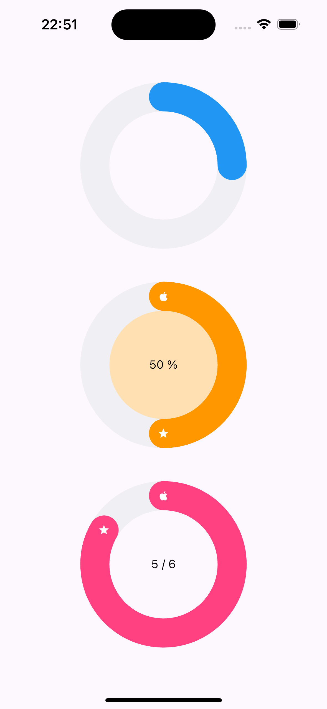
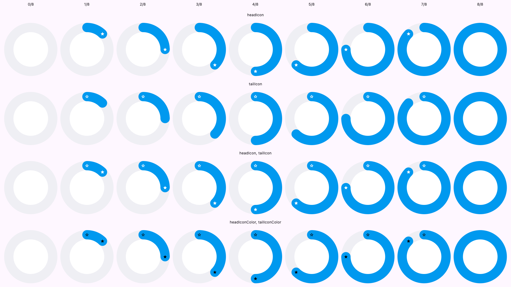
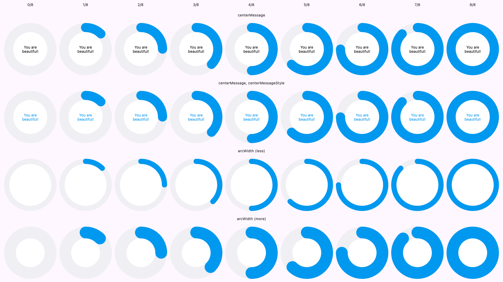

The package provides a beautiful and simple to use widget that renders
a circle with its progress arc. You might need it to show your users 
some progress or activity in your app.

## Features

The widget is quite simple in use and customizable
so you may play with it to choose the appropriate configuration.
Here are some basic states which you can combine to get the necessary customization:

## Use any icon for each of the side


## Set any color you want


## Change the width


## Usage

To use the basic state just pass the required params:

```dart
ProgressCircle(
    completed: 4.0,
    total: 8.0,
),
```

It's possible to create the same state as above from percent value:

```dart
ProgressCircle(
    completedPercent: 50.0,
),
```

If both groups are set,
then value `completedPercent` will be selected
while `completed` and `total` will be ignored:

```dart
ProgressCircle(
    completed: 2.0, // ignored
    total: 8.0, // ignored
    completedPercent: 50.0, // selected
),
```

So there are some named constructors for your convenience
that ask only required params for your current case.

```dart
ProgressCircle.fromValues(
    total: 4.0,
    completed: 8.0,
),
```

```dart
ProgressCircle.fromPercent(
    completedPercent: 50.0,
),
```

You may round the head or tail:

```dart
ProgressCircle(
    boxSize: 300,
    completed: 7,
    total: 8,
    isRoundedHead: true,
    isRoundedTail: true,
),

// Or use this constructor.
ProgressCircle.rounded(
    boxSize: 300,
    completed: 7,
    total: 8,
),
```

If you want to set some icon:

```dart
ProgressCircle(
    boxSize: 300,
    completed: 7,
    total: 8,
    headIcon: Icons.star,
    tailIcon: Icons.star_border,
    headIconColor: Colors.white,
    tailIconColor: Colors.black,
),
```

Set your message to the center:

```dart
ProgressCircle(
    boxSize: 300,
    completed: 7,
    total: 8,
    centerMessage: 'You are beautiful!',
    centerMessageStyle: TextStyle(
        color: Colors.blue,
        fontSize: 14,
    ),
),
```

Play with arc with and change the color:

```dart
ProgressCircle(
    boxSize: 300,
    completed: 7,
    total: 8,
    arcWidth: 45,
    progressArcColor: Colors.orange,
    innerColor: Colors.redAccent,
),
```
