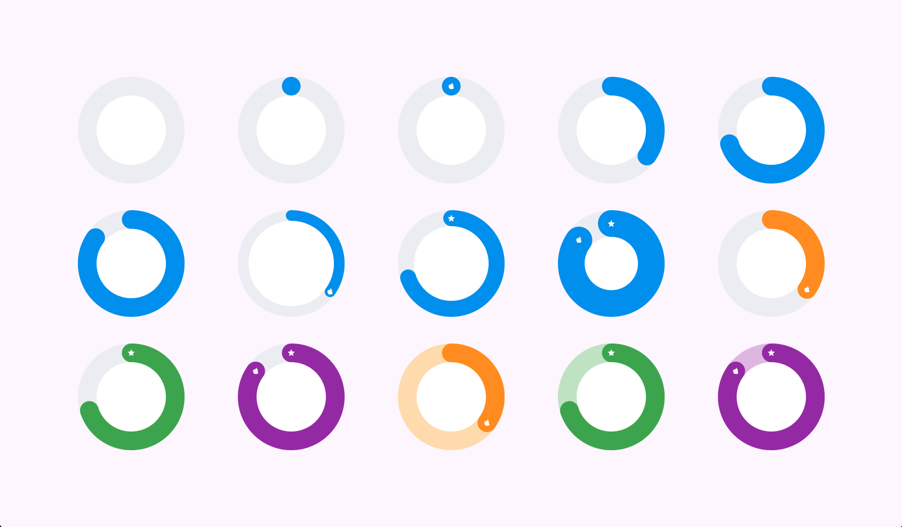

The package provides a beautiful and simple to use widget that renders
a circle with its progress arc. You might need it to show your users 
some progress or activity in your app.

## Features

The widget is quite simple in use and customizable
so you may play with it to choose the appropriate configuration.
Here are some basic states which you can combine to get the necessary customization:

## Here's an example of basic states you can do


## Usage

To use the basic state just pass the required params:

```dart
ProgressCircle(
    completed: 4.0,
    total: 8.0,
),
```

It's possible to create the same state as above from percent value:

```dart
ProgressCircle(
    completedPercent: 50.0,
),
```

If both groups are set
then value `completedPercent` will be selected
while others will be ignored:

```dart
ProgressCircle(
    completed: 2.0, // ignored
    total: 8.0, // ignored
    completedPercent: 50.0, // selected
),
```

So there are some named constructors for your convenience
that ask only required params for your current case:

```dart
ProgressCircle.fromValues(
    total: 4.0,
    completed: 8.0,
),
```

```dart
ProgressCircle.fromPercent(
    completedPercent: 50.0,
),
```

Wiget size can be changed by the corresponding field:

```dart
ProgressCircle(
    completedPercent: 50,
    size: Size.fromRadius(75),
),
```

There is a style property so it's customizable:

```dart
ProgressCircle(
    completedPercent: 50,
    style: ProgressCircleStyle(
        progressArcColor: Colors.orange,
        headIcon: Icons.star,
        tailIcon: Icons.apple,
        centerMessage: 'You are beautiful!',
        centerMessageStyle: TextStyle(
            color: Colors.orange,
            fontSize: 14,
        ),
    ),
),
```

It's also possible to configurate how you want to show zero progress,
so if you want to have a rounded head at zero point when progress is zero,
then just set this property:

```dart
ProgressCircle(
    completedPercent: 0, // or use `total` with `completed`
    style: ProgressCircleStyle(
        showZeroProgress: true,
    ),
),
```

There are also other properties for customization inside style,
so you may play with it to set the appropriate configuration.
